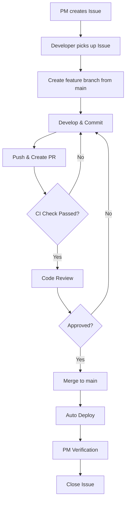

# Development Workflow Guide

## Team Structure

- **Developers**: 5-6 people
- **PM**: 1 person

---

## Flowchart



---

## Quick Reference

| Step | Who | Action                                |
| ---- | --- | ------------------------------------- |
| 1    | PM  | Create Issue with acceptance criteria |
| 2    | Dev | Pick up Issue, create branch          |
| 3    | Dev | Develop, commit, push                 |
| 4    | Dev | Open Pull Request                     |
| 5    | CI  | Auto run lint, test, build            |
| 6    | Dev | Code review (1 approval required)     |
| 7    | Dev | Merge to main                         |
| 8    | CI  | Auto deploy to AWS                    |
| 9    | PM  | Verify & close Issue                  |

---

## Branch Naming

| Type     | Format                 | Example                |
| -------- | ---------------------- | ---------------------- |
| Feature  | `feature/description`  | `feature/user-login`   |
| Bug Fix  | `fix/description`      | `fix/header-bug`       |
| Refactor | `refactor/description` | `refactor/api-cleanup` |

---

## Commit Message Format

Use [Conventional Commits](https://www.conventionalcommits.org/):

```
feat: add login API endpoint
fix: resolve header overflow issue
docs: update README
test: add unit tests for auth
refactor: restructure API routes
chore: update dependencies
```

---

## Git Commands Cheatsheet

```bash
# 1. Start new work
git checkout main
git pull origin main
git checkout -b feature/your-feature

# 2. During development
git add .
git commit -m "feat: your message"

# 3. Push and create PR
git push origin feature/your-feature
# Then create PR on GitHub

# 4. After PR merged, cleanup
git checkout main
git pull origin main
git branch -d feature/your-feature
```

---

## Pull Request Checklist

Before requesting review:

- [ ] Code follows project style guide
- [ ] Tests pass locally (`npm test`)
- [ ] Lint passes (`npm run lint`)
- [ ] PR title follows format: `type: description (#issue-number)`
- [ ] PR description explains what and why
- [ ] Issue is linked (`Closes #XX`)

---

## CI/CD Pipeline

```
PR Created/Updated
    │
    ├─ backend changes  → backend-pr-check.yml  (lint, test, build, docker)
    └─ frontend changes → frontend-pr-check.yml (lint, build)

PR Merged to main
    │
    ├─ backend changes  → backend-ci-cd.yml    (deploy to ECS)
    └─ frontend changes → frontend-deploy.yml  (deploy to S3/CloudFront)
```

---

## Code Review Guidelines

**Reviewer should check:**

- Logic correctness
- Code readability
- Test coverage
- Security concerns
- Performance implications

**Review response time:** Within 24 hours

---

## Branch Protection Rules

Recommended GitHub settings for `main` branch:

| Setting                   | Value |
| ------------------------- | ----- |
| Require pull request      | ✅    |
| Required approvals        | 1     |
| Require status checks     | ✅    |
| Require branch up to date | ✅    |

---

## Questions?

Contact your PM or team lead.
