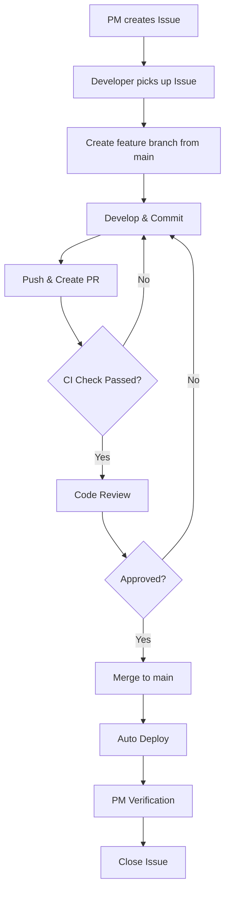

# Development Workflow Guide

## Team Structure

- **Developers**: 5-6 people
- **PM**: 1 person

---

## Prerequisites

Before starting, ensure you have installed:

| Tool    | Version | Check Command |
| ------- | ------- | ------------- |
| Node.js | 20+     | `node -v`     |
| npm     | 10+     | `npm -v`      |
| Docker  | Latest  | `docker -v`   |
| Git     | Latest  | `git -v`      |

---

## Project Structure

```
devops-pipelines/
├── .github/workflows/     # CI/CD pipelines
├── backend/               # Express.js API (TypeScript)
├── frontend/              # React app (Vite + TypeScript)
├── Documents/             # Team documentation
├── .env                   # Docker Compose environment
├── .env.example           # Environment template
└── docker-compose.yaml    # Local development services
```

---

## Local Development Setup

### Option A: Docker Compose (Recommended)

Best for: Consistent environment, no local MySQL needed.

```bash
# 1. Clone and setup
git clone <repo-url>
cd devops-pipelines
cp .env.example .env

# 2. Start all services
docker compose up -d

# 3. View logs (optional)
docker compose logs -f

# 4. Stop services
docker compose down
```

**Services:**
| Service | URL |
|---------|-----|
| Frontend | http://localhost:5173 |
| Backend | http://localhost:3000 |
| MySQL | localhost:3306 |

### Option B: Direct npm

Best for: Faster startup, easier debugging.

**Requires:** Local MySQL running on port 3306.

```bash
# Terminal 1: Backend
cd backend
cp .env.example .env
# Edit .env if needed (e.g., DB_HOST=localhost for local MySQL)
npm install
npm run dev

# Terminal 2: Frontend
cd frontend
cp .env.example .env
npm install
npm run dev
```

---

## Environment Variables

### Root `/.env` (Docker Compose)

```env
DB_HOST=mysql
DB_PORT=3306
DB_USER=app_user
DB_PASSWORD=app_password
DB_NAME=app_db
MYSQL_ROOT_PASSWORD=root_password
```

### Backend `/backend/.env`

```env
PORT=3000
NODE_ENV=development
DB_HOST=mysql          # Use 'localhost' if running without Docker
DB_PORT=3306
DB_USER=app_user
DB_PASSWORD=app_password
DB_NAME=app_db
```

### Frontend `/frontend/.env`

```env
VITE_API_BASE_URL=http://localhost:3000
```

> ⚠️ **Important:** Keep both `.env` files in sync when making changes.

---

## Development Flowchart



---

## Quick Reference

| Step | Who | Action                                |
| ---- | --- | ------------------------------------- |
| 1    | PM  | Create Issue with acceptance criteria |
| 2    | Dev | Pick up Issue, create branch          |
| 3    | Dev | Develop, commit, push                 |
| 4    | Dev | Open Pull Request                     |
| 5    | CI  | Auto run lint, test, build            |
| 6    | Dev | Code review (1 approval required)     |
| 7    | Dev | Merge to main                         |
| 8    | CI  | Auto deploy to AWS                    |
| 9    | PM  | Verify & close Issue                  |

---

## Branch Naming

| Type     | Format                 | Example                |
| -------- | ---------------------- | ---------------------- |
| Feature  | `feature/description`  | `feature/user-login`   |
| Bug Fix  | `fix/description`      | `fix/header-bug`       |
| Refactor | `refactor/description` | `refactor/api-cleanup` |
| Hotfix   | `hotfix/description`   | `hotfix/critical-bug`  |

---

## Commit Message Format

Use [Conventional Commits](https://www.conventionalcommits.org/):

```
feat: add login API endpoint
fix: resolve header overflow issue
docs: update README
test: add unit tests for auth
refactor: restructure API routes
chore: update dependencies
```

**With scope (optional):**

```
feat(auth): add JWT token validation
fix(ui): resolve button alignment issue
```

---

## Git Commands Cheatsheet

```bash
# 1. Start new work
git checkout main
git pull origin main
git checkout -b feature/your-feature

# 2. During development
git add .
git commit -m "feat: your message"

# 3. Push and create PR
git push origin feature/your-feature
# Then create PR on GitHub

# 4. After PR merged, cleanup
git checkout main
git pull origin main
git branch -d feature/your-feature
```

---

## Common Development Commands

### Backend

```bash
cd backend
npm run dev          # Start dev server with hot reload
npm run build        # Build TypeScript
npm test             # Run tests
npm run lint         # Run ESLint
```

### Frontend

```bash
cd frontend
npm run dev          # Start Vite dev server
npm run build        # Build for production
npm run lint         # Run ESLint
npm run preview      # Preview production build
```

### Docker

```bash
docker compose up -d          # Start all services
docker compose down           # Stop all services
docker compose logs -f        # View logs
docker compose ps             # List running services
docker compose restart        # Restart services
```

---

## Pull Request Checklist

Before requesting review:

- [ ] Code follows project style guide
- [ ] Tests pass locally (`npm test`)
- [ ] Lint passes (`npm run lint`)
- [ ] PR title follows format: `type: description (#issue-number)`
- [ ] PR description explains what and why
- [ ] Issue is linked (`Closes #XX`)

---

## CI/CD Pipeline

```
PR Created/Updated
    │
    ├─ backend changes  → backend-pr-check.yml  (lint, test, build, docker)
    └─ frontend changes → frontend-pr-check.yml (lint, build)

PR Merged to main
    │
    ├─ backend changes  → backend-ci-cd.yml    (deploy to ECS)
    └─ frontend changes → frontend-deploy.yml  (deploy to S3/CloudFront)
```

---

## Code Review Guidelines

**Reviewer should check:**

- Logic correctness
- Code readability
- Test coverage
- Security concerns
- Performance implications

**Review response time:** Within 24 hours

**Tips for reviewers:**

- Be constructive, not critical
- Suggest improvements, don't demand
- Approve if changes are minor

---

## Branch Protection Rules

Recommended GitHub settings for `main` branch:

| Setting                   | Value |
| ------------------------- | ----- |
| Require pull request      | ✅    |
| Required approvals        | 1     |
| Require status checks     | ✅    |
| Require branch up to date | ✅    |

---

## Troubleshooting

### Docker Issues

**Port already in use:**

```bash
# Find and kill process using port 3000
lsof -i :3000
kill -9 <PID>
```

**MySQL connection refused:**

```bash
# Wait for MySQL to be ready, then restart backend
docker compose restart backend
```

**Clean restart:**

```bash
docker compose down -v  # Remove volumes too
docker compose up -d
```

### npm Issues

**Dependency errors:**

```bash
rm -rf node_modules package-lock.json
npm install
```

---

## Questions?

Contact your PM or team lead.
