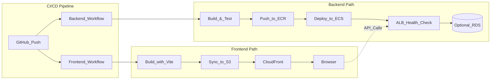

# DevOps Pipelines - Doublespot Example

A complete end-to-end example project demonstrating how to use Docker Compose for local development and deploy backend to AWS ECS (Fargate) and frontend to S3 + CloudFront via GitHub Actions CI/CD.

## Project Architecture

### Backend Deployment Path
```
GitHub Actions → ECR → ECS (Fargate) → ALB → (Optional) RDS MySQL
```

### Frontend Deployment Path
```
GitHub Actions → S3 → CloudFront → Browser
```

### Architecture Flow Diagram



## Local Development

### Prerequisites

- Docker and Docker Compose
- Node.js 20+ (optional, for local development without Docker)

### Starting Services

1. Copy environment variable example files (if you need custom configuration):
   ```bash
   cp backend/.env.example backend/.env
   cp frontend/.env.example frontend/.env
   ```

2. Start all services:
   ```bash
   docker compose up --build
   ```

   **Note:**
   - docker-compose uses development Dockerfiles (`Dockerfile.dev`) with hot-reload support
   - Production Dockerfiles are used for CI/CD deployment
   - Docker environment uses fixed ports (Backend: 3000, Frontend: 5173)
   - Local development (without Docker) can customize ports via `.env` files

3. Verify services are running:
   - Backend: http://localhost:3000
   - Frontend: http://localhost:5173
   - Health Check: `curl http://localhost:3000/health`

4. Code changes will automatically reload (no need to rebuild)

### Health Check Endpoints

The project provides two health check endpoints:

- **`GET /health`** - Simple health check (for ALB)
  - Returns: `200 OK` with `"ok"` string
  - No external dependencies, suitable for ALB health checks

- **`GET /health/db`** - Database connection check
  - Returns: JSON formatted status information
  - Includes database connection status

### Building Backend Docker Image Locally

**Development environment (with hot-reload):**
```bash
cd backend
docker build -f Dockerfile.dev -t doublespot-backend:dev .
docker run -p 3000:3000 -v $(pwd):/app -v /app/node_modules doublespot-backend:dev
```

**Production environment (optimized build):**
```bash
cd backend
docker build -t doublespot-backend:prod .
docker run -p 3000:3000 doublespot-backend:prod
```

## GitHub Actions CI/CD Configuration

### Required GitHub Variables

Configure the following Variables in GitHub Repository Settings → Secrets and variables → Actions:

#### Backend Deployment Required
- `AWS_REGION` - AWS region (e.g., `us-west-2`)
- `AWS_ROLE_TO_ASSUME` - OIDC IAM Role ARN (for GitHub Actions authentication)
- `ECR_REPOSITORY` - ECR repository name (e.g., `doublespot-backend`)
- `ECS_CLUSTER` - ECS cluster name
- `ECS_SERVICE` - ECS service name
- `CONTAINER_NAME` - ECS container name

#### Frontend Deployment Required
- `AWS_REGION` - AWS region (e.g., `us-west-2`)
- `AWS_ROLE_TO_ASSUME` - OIDC IAM Role ARN (for GitHub Actions authentication)
- `S3_BUCKET` - S3 bucket name (for storing frontend static files)
- `CLOUDFRONT_DISTRIBUTION_ID` - CloudFront distribution ID
- `VITE_API_BASE_URL` - API base URL used during frontend build (e.g., `https://api.example.com`)

### Workflow Descriptions

#### Backend CI/CD (`backend-ci-cd.yml`)

**Trigger Conditions:**
- Push to `main` branch
- Only triggers when `backend/**` paths change

**Process:**
1. Checkout code
2. Setup Node.js 20
3. Install dependencies and build (`npm ci` + `npm run build`)
4. Configure AWS credentials using OIDC
5. Login to Amazon ECR
6. Build and push Docker image (tagged with commit SHA)
7. Render ECS Task Definition (replace `__IMAGE_URI__` placeholder)
8. Deploy to ECS service and wait for stability

#### Frontend Deploy (`frontend-deploy.yml`)

**Trigger Conditions:**
- Push to `main` branch
- Only triggers when `frontend/**` paths change

**Process:**
1. Checkout code
2. Setup Node.js 20
3. Install dependencies
4. Build frontend (inject `VITE_API_BASE_URL` environment variable)
5. Configure AWS credentials using OIDC
6. Sync `dist/` directory to S3 (using `--delete` to remove old files)
7. Invalidate CloudFront cache

#### CI Pipeline (`pipeline.yaml`)

Used for Pull Request checks, executes:
- Backend build and type checking
- Frontend build and lint checking

## AWS Resource Requirements

This project assumes the following AWS resources are pre-configured:

### Backend Required Resources
- ECR repository (for storing Docker images)
- ECS Cluster (Fargate)
- ECS Service (configured service)
- Application Load Balancer (ALB) + Target Group
  - Health check path set to `/health`
- IAM Role (for OIDC, trusts GitHub Actions)
- CloudWatch Log Group (`/ecs/doublespot-backend`)

### Frontend Required Resources
- S3 bucket (for storing static files)
- CloudFront distribution (pointing to S3 bucket)
- IAM Role (for OIDC, trusts GitHub Actions)

### Task Definition Template

`backend/taskdef.template.json` contains the ECS Task Definition template. During deployment, the workflow automatically replaces the following placeholders:
- `__IMAGE_URI__` - Replaced with actual ECR image URI
- `__CONTAINER_NAME__` - Replaced with `CONTAINER_NAME` variable
- `__AWS_REGION__` - Replaced with `AWS_REGION` variable

**Note:** You need to update the following fields according to your actual environment:
- `executionRoleArn` - ECS Task Execution Role ARN
- `taskRoleArn` - ECS Task Role ARN (optional)
- `awslogs-group` - CloudWatch Log Group name

## ALB Health Check Configuration

ALB Target Group health check should be configured as:
- **Path:** `/health`
- **Protocol:** HTTP
- **Port:** 3000
- **Healthy threshold:** 2
- **Unhealthy threshold:** 3
- **Timeout:** 5 seconds
- **Interval:** 30 seconds

The `/health` endpoint is designed to be fast and have no external dependencies, ensuring ALB can reliably check service status.

## Project Structure

```
devops-piplines/
├── backend/
│   ├── src/
│   │   ├── server.ts          # Server entry point
│   │   ├── app.ts             # Express app configuration
│   │   ├── routes/
│   │   │   └── health.route.ts # Health check routes
│   │   └── config/
│   │       ├── env.ts         # Environment variables config
│   │       └── db.ts          # Database connection
│   ├── Dockerfile             # Backend production image (multi-stage build)
│   ├── Dockerfile.dev         # Backend development image (hot-reload)
│   ├── taskdef.template.json  # ECS Task Definition template
│   └── package.json
├── frontend/
│   ├── src/
│   │   ├── App.tsx
│   │   ├── main.tsx
│   │   ├── api/
│   │   │   └── client.ts      # API client utilities
│   │   ├── hooks/
│   │   │   └── useHealthCheck.ts # Health check hook
│   │   └── pages/
│   │       └── Home.tsx
│   ├── Dockerfile             # Frontend production image
│   ├── Dockerfile.dev         # Frontend development image (hot-reload)
│   └── package.json
├── .github/
│   └── workflows/
│       ├── backend-ci-cd.yml  # Backend deployment workflow
│       ├── frontend-deploy.yml # Frontend deployment workflow
│       └── pipeline.yaml      # CI check workflow
├── docker-compose.yml         # Local development configuration
└── README.md
```

## Tech Stack

- **Backend:** Node.js 20, TypeScript, Express
- **Frontend:** Vite, React, TypeScript
- **Database:** MySQL 8.4 (optional, for local development)
- **Container:** Docker, Docker Compose
- **CI/CD:** GitHub Actions
- **Cloud:** AWS (ECR, ECS Fargate, ALB, S3, CloudFront)

## Troubleshooting

### Docker Compose Won't Start
- Verify Docker and Docker Compose are correctly installed
- Check if ports 3000 and 5173 are already in use
- View logs: `docker compose logs`

### Health Check Fails
- Verify backend service is running: `curl http://localhost:3000/health`
- Check database connection (if using): `curl http://localhost:3000/health/db`

### GitHub Actions Deployment Fails
- Verify all required GitHub Variables are set
- Check AWS IAM Role trust relationship is correctly configured (trusts GitHub)
- Verify ECR, ECS, S3 resources are correctly created
- View workflow execution logs for detailed error messages

## License

ISC
